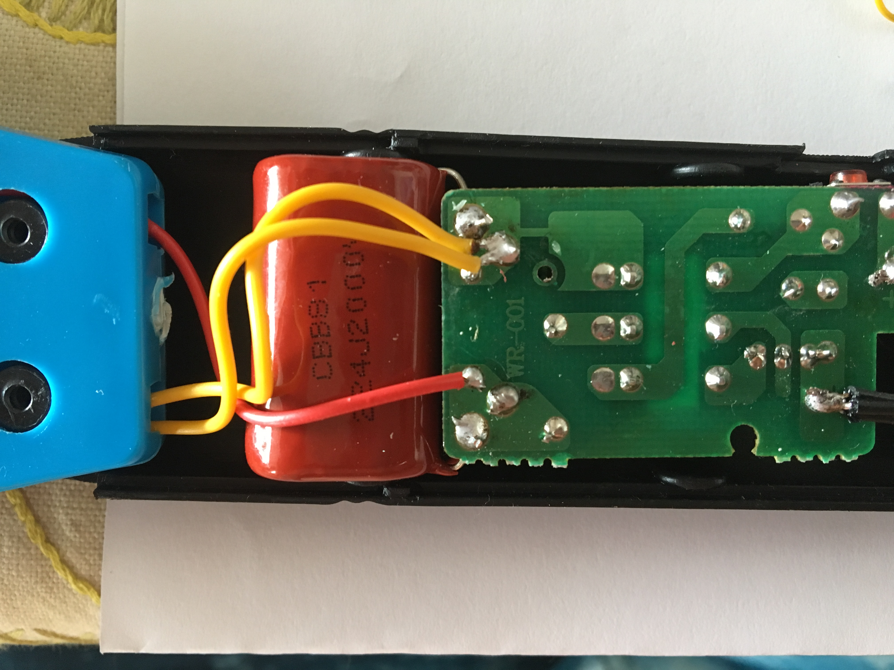
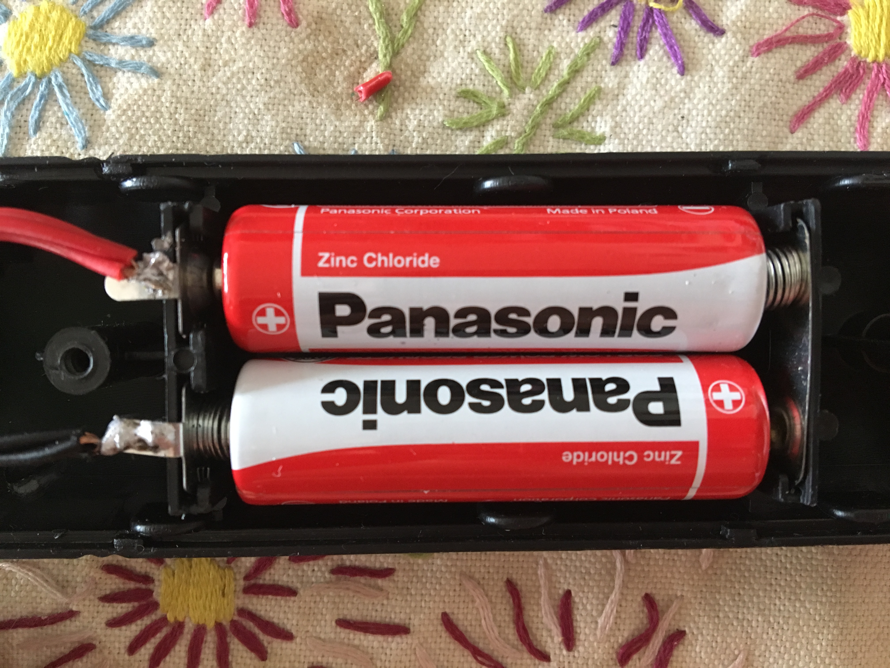
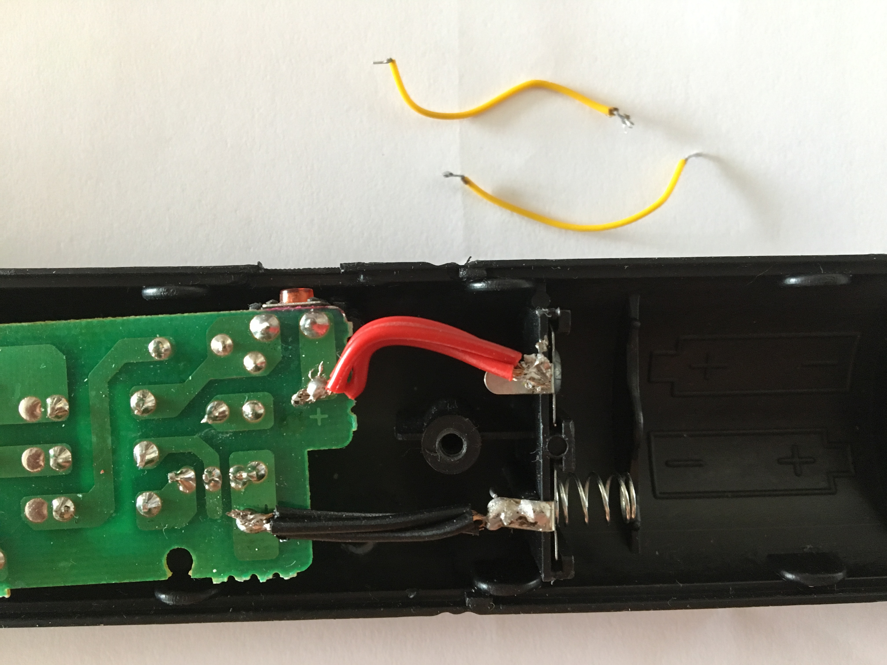

# ElectronicFlySwatter-Upgrade
Upgrade a common electrical flyswatter bat to get more punch

# Introduction

The common electronic flyswatter bat might nog give enough punch to your needs, eg you might be able to get it effective on wasps and bigger flying insects (like horse flies).

# Issues with non modified Electronic Flyswatters

    * Wasps are not impressed at all with your un-modified fly swatter, and keep coming (back)
    * Huge stinging flies (like horse flies) are not impressed and keep coming also.

# Solution

    * Upgrade the fly swatter to get more punch, and make sure bigger insects got the message, and get get killed, or do no longer return when hit once.

# Goals 

* higher output voltage
* higher capacity on discharge
* fast charge to ready output
* high output current for continues "frying"
* remove the high pitched sound, not warning the suspects

# Commonly proposed modifications

* Remove the parallel discharge resistor
* add bigger capacitor 
   

# Not seen mentioned before

* Use Alkaline batteries, and not Zink-Chloride
    * Alkaline has much lower internal resistance
     
* Replace thin power (battery) wires by thick onces
    * remove unneeded extra resistance
    
* shorten the power wires
    * remove extra resistance
* replace switching transistor with lower Vsat like ZTX1048A
    * leave a higher effective voltage on switching transformer
    Replacing the transistor did no produce that much higher output voltage, but at around 1400V way above the 1N1007 specs, which might limit the voltage because it triggers (controlled) breakdown.
* Upgrading the output/high voltage diode.
    * Desired properties
        * use a higher breakdown voltage
        * low capacitance
        * low reverse leakage diode
        * (ultra) fast switching
    * 1N4007 replaced by RFC4K:  Wow... by just replacing the diode (1N4007 by a RFC4K, which might not the best) voltage increased from about 1400 to 1900V !! this is the kind of changes looking for. Just below the rated value of the upgraded output capacitor) (with 22MOhm discharge resistor connected)
    * replacing the 1N4007 by a 2CL73A diode produces even 2100V !! . (With 22Mohm discharge resistor connected)
* Tuning base resistor
    * lowering the base resistor decreses charge frequency, but produces higher voltage
    * increasing the base resistor increasing the charge frequency, but lowers output voltage.
* [Untested] use a boost convertor to get a little higher voltage (5V)
    * this might impact static current settings, and might need output diode and capacitor upgraded to a higher voltage.
* [Failed] adding an extra diode and capacitor to build a Villard cascade voltage multiplier.
    * For some unknown reason I did not manage to get a higher voltage. then without.

# Simple tests

Issue: Most Voltage meaters won't go over 1000V DC, you possible ruin your meter when trying.

Primitive but easy to execute tests:
    * modificate the dischange reesitor my making a voltage divider and provide a low voltage meter option.
     add a resistor ~1/100 or ~1/1000 in series with the discharge resistor, and your voltmeter can easy measure/calculate the output voltage. 
    * test single discharge with a isolated screwdriver to notice possible improved "punch"
    * test repeated discharge with a isolated scredriver, and leave a smal air gab, and notice imporivemd in speed is discharges again.

# Words of warning

    * These devices are not for children
    * Removing the discharge reistor may surprise you or someone else sooner or later, I recomment to upgrade dischange resistor to voltage divider as described above.
    * Verify the original output capacitor, mine was carried labels 300V~  and 250V~ and was certainly not rated for the 2000V after upgrading. It did kept up, but I removed it.
    * Testing with transistors base resistors: too low value
        * voltage starts dropping
        * oscillating will stop
        * you might burn the switching transistor (bad batteries (Zinc-Choride) with high internal resistance might protect you)
    * Proposed modification may void warrenty
    * Proposed changes might get them no longer certified
    * Mark your fly swatter, for example with red tape, so you are remembered what has been executed on the device.
