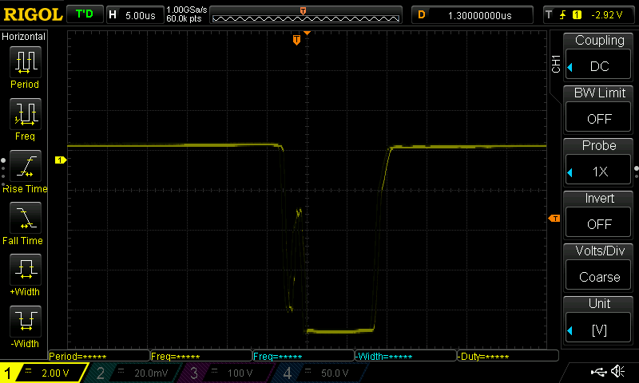
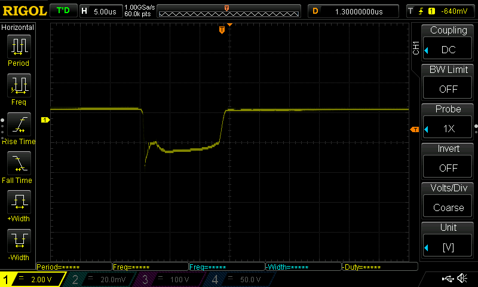
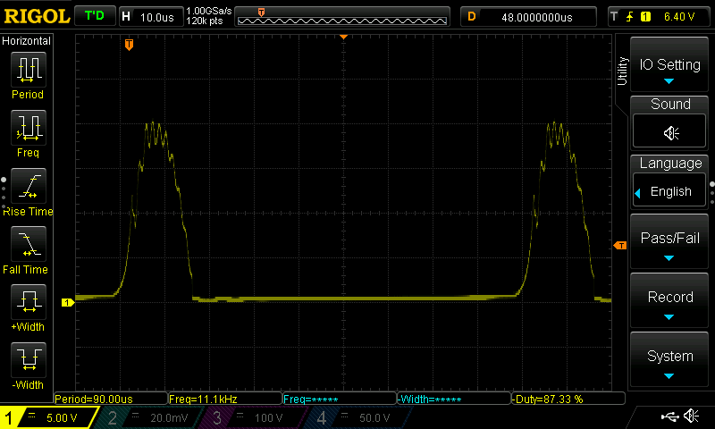
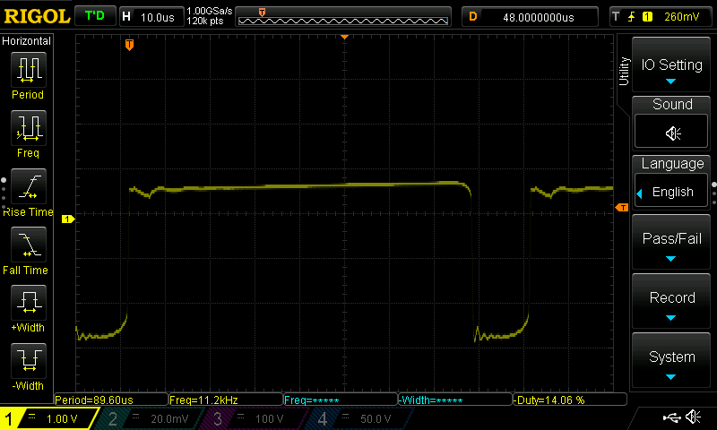
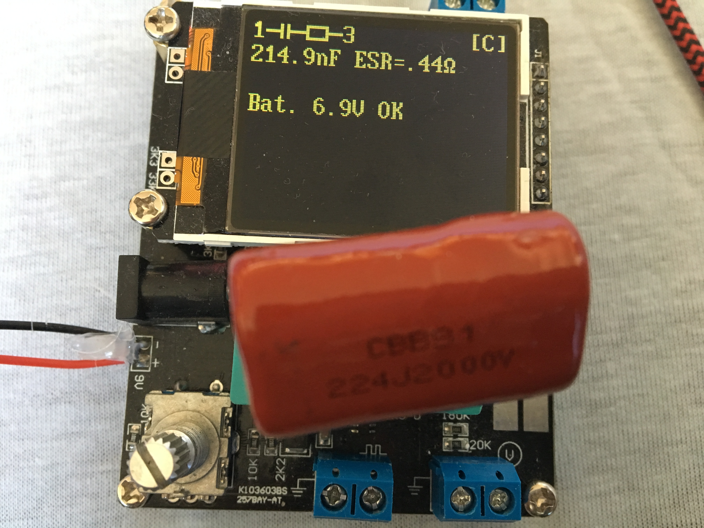
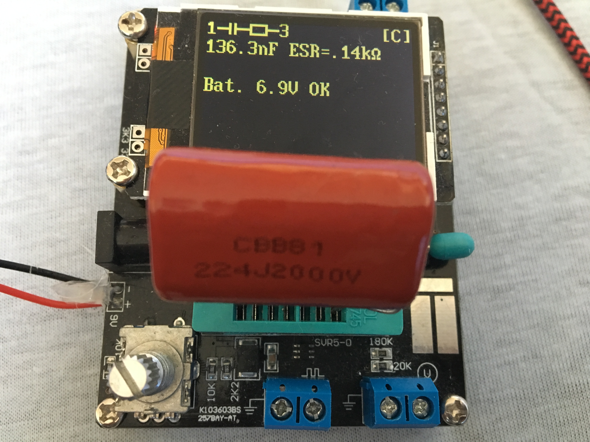

# The path to ultimate ElectronicFlySwatter racket upgrade

Upgrade a common electrical/battery operated flyswatter racket to get more punch, because a standard just doesn't do it verry well.

# Introduction

The common electronic flyswatter bat might not give enough punch to your needs and/or you might be able to get it effective on wasps/Yellow Jackets and bigger flying insects (like horse flies).

# Functional issues with non modified Electronic Flyswatters

    * Big insects, like Wasps (Yellow Jackets) and  Horse flies, are not impressed at all with your un-modified fly swatter, and keep coming (back)
    * Unable to finish insect caught in the metal mesh.
    * A high pitched sound produced warning whoever can hear it.
    * Small insect might simply not trigger a discharge, and insect fly through metal mesh
    * 3-layer mesh is not easy to clean
    * provided power might decrese when battery is used.

# Technical issues with non modified Electronic Flyswatters

The Functional issues translated into technical

    * The flyswatter bat may not produce a real impressive DC voltage to penetrate the insect well enough.
    * The flyswatter voltage might not be close to the breakdown voltage of the metal mesh, leaving room for small insect to fly through.
    * The flyswatter bat may not have enough capacity to provide enough discharge energy.
    * The flyswatter may not able to produce a decent voltage and current when having a load (read insect in metal mesh)
    * Advertized device provides a charge no more then 45 micro Coulombs. As the charge = Voltage * (Output) Capacitance, 1000V dictates only 45nF (@1000V), so all items are related to each other. 
    * provided voltage depend heavily on battery type, status/internal resistance and/or brand.

# Functional desires

    * Start to buy the right type! The one-layer grid is the best for catching the biggest, smallest and most easy to clean, but the also most dangerous for you and children.
    * Upgrade the fly swatter to get more punch, lets call this impulse or discharge power, and make sure bigger insects got the message, and get either killed or at least do not longer return when hit just once. (this is what we start to talk about)
    * Upgrade the output voltage as such not much room is left for small insects to fly through the metal mesh, without getting discharge.
    * A nice capability is to be able to have enough power to "fry" a target, lets call this nominal or static power.

    * The device still needs quickly ready for operation, within a second after pusing the button.
    * High pitched sound is slightly annoying, and may warn the possible victems. 
    * The device should as much as possible feel, and look the same as orginal.
    * Battery charge capability would be nice.
    * Constant performance not (mainly) depending on battery status would be nice.
 
# Functional desired translated into technical Goals 

* higher output voltage, 4000V is maximum flyswatter commercially available, but unknown in capacitance to me.
    * Find out what provides an optimum in voltage, stored energy, and breakdown voltage of the mesh
* higher impulse capacity on discharge. Searching for higher capacitance and higer voltage options. I found the CBB* range of capacitors range: 
    * maxes out at to 2000V DC rated. Above 2000V you end up with ceramic type of capacitors.
    * compact, a nice volume/capacitance ratio.
* fast ready for action, not waiting to charge output capacitor.
    * instant, within a second,  ready is perfectly acceptable.
    * 
* high "nominal" output current for continues "frying", or able to start even when a guest is trapped between electrodes.
    * The exact values may need to be defined SMART.
* remove/avoid the high pitched sound
    * higher frequency, or eliminate the sound not warning the suspects.
    * fixating resonant components
    * lower stress on commponents.
* look and feel not changed:
    * Not making it too much heavier
    * Try to make use of existing design knobs and battery holder.
    * No external connected -capacitors, -transformers, -powercables, -batteries ... etc.
* USb charging, microUSB connection, Li-ion Battery, backwards compatibel.
* Providing som kind of voltage regulation to keep performance consistent over time/battery life.

# Commonly proposed modifications

* Remove/disconnect the high voltage discharge resistor
    * Note: I can not recommend this due to high risk of shock or even fire, even hours after usage. Even with a factory default device, this shock is an unpleasant experience.  Think of it how it would feel after upping the device.
* add bigger capacitor, it works but see below. 
   

# Not seen mentioned before

* Use Alkaline batteries, and not Zink-Chloride
    * Alkaline has much lower internal resistance
     
* Replace thin power (battery) wires by thick onces
    * remove unneeded extra resistance
    
* shorten the power wires
    * remove extra resistance
* replace switching transistor with lower Vsat like ZTX1048A
    * leave a higher effective voltage on switching transformer
    Replacing the transistor did no produce that much higher output voltage, but at around 1400V way above the 1N1007 specs, which might limit the voltage because it triggers (controlled) breakdown. (See next items) 
* Upgrading the output/high voltage diode.
    * Desired properties
        * use a higher breakdown voltage
        * low capacitance
        * low reverse leakage diode
        * (ultra) fast switching
    * 1N4007 replaced by RFC4K:  Wow... by just replacing the diode (1N4007 by a RFC4K, which might not the best) voltage increased from about 1400 to 1900V !! this is the kind of changes looking for. Just below the rated value of the upgraded output capacitor) (with 22MOhm discharge resistor connected)
    * replacing the 1N4007 by a 2CL73A diode produces even 2100V !! . (With 22Mohm discharge resistor connected)
* Tuning base resistor
    * lowering the base resistor decreses charge frequency, but produces higher voltage
    * increasing the base resistor increasing the charge frequency, but lowers output voltage.
    * Be aware not to to destroy the transistor with too high base current (potentiometer set to zero)
* Increase the power supply voltage, by replacing batteries by something else. (Dependencies: Base resistor tuning, transistor upgrade, diode upgrade, capacitor upgrade)
    * [Failed] use a boost convertor to get a higher voltage (5V). This proved far below expectations for me.
    * [Failed] Use a 9V battery Block. This proved to be far below expectations, most likely:
        * 9V battery block was empty
        * High internal resistance, not capable of producing enough current.
    * Using a 3.7 Li-ion micro battery (from RC-quadcopter). This proved to be more effective then expected, and voltage upped to over 2800V (from 2100V) 
        * Calculated with 3.7V but actual voltage was 4.1xx V. caclulating with 4.1V (vs 3V) the output voltsage increased as expected)
        * Internal resistance is expected to be low, and can keep up with the higher demand.
        * Note: later with slightly different conditions I was not able to reproduce the 2800V, after replacing the burned transistor.
    * [Failed] Increasing the Voltage more dramatically, by using 2 14500 Li-Ion 3.7V batteries instead 2x 1.5V AA
        * With just a singele charged Li-ion 141500 3.7V (4.2 when charged) I measured a peak of over 60V which is 10V above absolute maximum specifications, and when doubbling input voltage, this would tend to double as well, a rootcause for failure.
           

        * With just a singele charged Li-ion 141500 3.7V (4.2 when charged) I measured about 9V negative voltage, way above specs of 5V as absolute maximum: 
           
           A rootcause for immediate failure
        * By placing a 1N4007 in reverse over base emitter, this risk is easy mittigated, perhaps choosing an UF4007 later.
        

        * So it is clear now for futher "improvements" the transistor needs to be upgraded 2x60V + save margin: 150V minimum. And after this type of tuning, the transistor is higly stressed. High risk of failure. Didn't check the current.
        * 
* Rewind the transformator
    * Started with another board (diode upgrade/capacitor replaced/transistor replaced and added a reverse diode for Bese Emitter protection, but base resistor tuning, and no powerlines upgrade) and started this mod at around 1800V. Unwinded in order:
        * Feedback Coil, and counted 36 windings
        * Primary (low voltage) coil, and counted 43 windings
        * Left the secondary coil (high voltage) untouched, and I was lucky these windings where made first. (so easy to unwind primary and feedback coil)
        * Rewound primary and feedback coil with 10 windings each , about a quarter of originial.
    * Results
        * over 2500V (from 1800V), which isn't a quadrupling  as one might have expected (as the winding ratio had been quadrupled )
        * Higher charge frequency at around 11kHz and barely noticable
        * lower peak voltage on transistor Collector-Emitter now 40V, which is within the specs of the ZTX1048A, and a signal seems much cleaner.
        
        * Vbe became much nicer, but no surpises.
        
    * 
* Install a transformer with higher output voltage
    * The PCB may not capable of handling that, and start arcing on the PCB and burning it.
    * Tried some high voltstage mini transformers, but did't run into good results.
* Install a DIY HV-1 high voltage module 
    * Using a Li-ion battery 3,7V (4,2V when fully charged)
    * expected to produce about 10KV
    * This proof of concept worked, but didn't start to try to build-in. A drawback: it consumes quite some power in the base resistor, just burning energy.
    * The HV-1 module has a fundamenal design issue, just swithing the base resistor, and not complete power. When releasing the switch (but battery still connected) the circuit resonates just fine, altough at a bit lower output voltage. quite dangerous!!

* [Failed] adding a Villard cascade voltage multiplier (extra diode and capacitor)
    * This failed, most likely due to the form/pulse of out output voltage. need to be aware which side provides the most dominant pulse. Didn't try to repeat that, but notice further developments below.
* [Failed] replaced the electonics with the HV-1 high voltage generator and added the high voltage diode and capacitor.
    * It sparked, but I wasn't impressed by it at all (while using a single 3.7 Li-ion battery).
    * My multimeter dit go haywire, even when just connecting one terminal, not able to measure output voltage (possible due to much higher frequency).
    * Due to power consumption of base resistor and design issue mentionned above, the HV-1 lost my interest.

* [Failed] using mini CCFL circuits
    * A CCFL circuit produces around 1000V noninal, and much higher, but undefined in open lamp sitution.
    * Was able to voltages over 6000V DC easy, when adding a diode and capacitor.
        * Saw electrical arc's flying outside/over standard 1/4 resistor.
        * Saw 22Mohm, 1/4 starting to burn (6000V^2/22E6=1.6Watt)
        * When put on the metal mesh the flyswatter the voltage was above the breakdown voltage, and started to self discharge wildly twice a second or so.
        * With 10KV ceramic capacitors the sparc (released energy) was in the end not that impressive, and output voltage was difficult to regulate. The High voltage part was connected to the low voltage part, and burned my finger a few times by just holding the battery comportment....
        * So in the end, interesting project, but a bit too much for what i need.

* Replacing the PCB, with a slightly new/other design, and uses voltage muliplier buildin.
    * I found a PCB/module which contains a (Voltage quadradoubler](https://en.wikipedia.org/wiki/Voltage_doubler), by using two Greinacher cells of opposite polarities, and an NPN emitter switched tranformer, instead collector switched. Altough the module is sold as 1800V (or 2000V) booster, it produces around 3500V DC on a Li-ion battery. This PCB does not produce the high pitched sound, and solves another issue.
    * Replacing the slow diodes (500ns recovery) by diodes with 100ns recovery, the output raises a bit (4000V after some time)
    * Slightly raising the voltage on this module results in seemingly linear output voltage, but too much the circuit starts to make noise, and output capacitor is "cooking".
    * Nominal output voltage of 3500/3600V is reached quite quickly, almost instant.
    * No discharge resistors are part of the PCB, leaving it dangerous for you, keep charge hours  even weeks later. Likely to shock you or even start fire.
    * By simply upgrading the output capacitor from CBB81 223J2000V to a CBB81 224J2000V this get's very close to what I had in mind, a loud bang, and nice sparc, when shortcircuiting, but also quite capable of catching bigger flies (with a loud bang also) 
    * Using a Li-ion battery and upgraded output capacitor220nF CBB81 224J2000V and upgraded diodes, integrated into the flyswatter, i ran a field test, and that worked realy well for some time, but after maybe 20 or 30 flies (yes this time of the year flies collect in the neighborhood, probably near end of their life), the loud bang just was gone. fying worked still. The output capacitor failed completely, and measured only 0.0008nF instead 220nF !!!, probably open circuit. Capacitor died by the many power discharges, twice the overvoltage, or a combination of both. (investigation learned the contact plate on one end of the capacitor burned by high peek current.)
    * Replaced/Upgraded the output capacitor by a CBB21 105J2000V, and put a 2x10Mohm resitor in parallel of output capacitor for automatic discharge for safity and possible better longlivity of the output capacitor. Not keeping an overvoltage in capacitor hours after usage and keep streessing the output capacitor. In previous tests I found the 105J capactor was just too big (electrically) to charge quickly enough, and second it made such a loud bang I was afraight of hearing damage. Anyway, upped the capacitor to 105J now, did not measure the risetime of the output voltage, but it worked greatly to my satisfaction. Small flies just vaporized with a very loud bang and light flash. Some bigger flies exploded, depending on how they where hit.  There where no Wasps or Yellow Jackets to be seen, I guess the season is already over.  Hunted for flies for a durability test, and after about 20 flies or so the neighborhood ran out targets left to be tested. So I'm not sure if this capacitor survives, and needs attention or not. 
    * This PCB has the capability to produce even higer voltages, but going even higher then 4000V, twice the CBB capacitors voltage rating, It might needed to switch to the ceramic capactors, which I don't like... higher physical volume, lower capacitiance values, much higher weight .

# Some calculations

When upgrading the output capacitor, there are limitations you need to cope with

* physical size/dimenions of capacitor, it needs to fit inside the bug zapper
* The CBB range of capacitors is available up to 2000V, upto 224J (220nF) or even 105J (1uF)
* Ceramic capacitors are available to 10KV or even 30KV, upto 103J (10nF).

As the stored (read released) energy is according

* Stored charge (Coulomb) in capacitor= C(Farad) * V(olt)
* Stored energy in capacitor (impulse) E = 1/2 C U^2
* Released current: I =U^2/R
* Airgap
    * Break down voltage ,approx 3 kV/mm for dry air. or see https://en.wikipedia.org/wiki/Paschen%27s_law
        * With a given grid, you can calculate (or experiment) which maximum voltage it can carry before breakdown, start arcing. 
    * Break down recovery voltage
        * The voltage which makes the arc stop, with a fixed air gap, after breakdown has occured.
    * 
# stessing components

While "tuning" the circuit, higher voltages wil be generated, and more current will be drawn.
This stresses components, and may/will lead to failure or lower capacity.
In case of a capasitor you may want to use overvoltage, and a higher rated capacitor for that value simple does not fit or exist.

* By design the output capacitor seems to be operated above it's rated limit by default, and it is attractive to use overvoltage as accepted risk due to optimal capacitance/volume ration.
    * When MKT capacitors, which are self healing, overvoltage can be applied, and breakdown's are healed at the cost of loosing some capacity. My experience is having a CBB capacitor rated for 2000V, starts make a hissing/cooking sound at 6000~7000V and result in permanent damage See    :
        * Much higher ESR (0.44 Ohm initially to 140 Ohm after overvoltage)
        * Much lower capacitance then initially (214nF initially to 136nF after overvoltage)
* discharging the capacitor by basically shortcircuit (and then even with overvoltage), not every capacitor will survive repeated shortcircuits from (above) maximum rated voltage. 
    * It happened with the CBB81 223 2000V capacitors they fail in an open circuit mode, measuring multitude lower capacitance, nearing zero.  No voltage is mesured, no capacitance. So curious as you might get (after a week or so), you may decide to unwind and investigate the failure mode. 
        * carefully break all epoxy
        * Check external pins connect external contact point of rolled capacitor
        * Disconnect the pins, and find the begin of the rolled foil.
        * The begin of the foil is just foil, not metallized but...
        * Be prepared to receive a huge shock when start unwinding the metalized foil (even after a week or so). 
* the diode might work on or above its specifications
    * Limits the output voltage, which is this information page about, so undesired in this case.
    * may/will destroy the diode, resulting in total malfunctioning.
* Switching transistor
    * High peek voltages above specs for V(ce) and (Veb) due to shuttin current off abrubtly in an inductanc without freewheel diode/snubber. 
    * High/almost unlimitted current when reaching transformercore saturation.
* 

# Some value examples for released Energy and charge

An overview of some data and calculations of executed experiments, and some facts for reference, like the 22RL bullit and a destruction hammer.
The released energy with the 2uF@4000V modified flyswatter racket results in about a 3th of the energy of the impact of a descruction hammer and about a 10th of the energy of a small but deadly bullit.

|Circuit| Capacitance | Voltage   | Charge (Coulomb)  | Single shotEnergy  Joules    | Breakdown airgap | Discharge rate | Energy per second| Comments|
|-------------|-----------|--------|-----------|--------|------------------|----------------|-----------|------------|
|sample|22nF 1xCBB85| 2045V|45uC (1x)| 0,046 (1x)|0,66mm| about once in 5 seconds in native flyswatter circuit| 0,0066J/s|Maximum Voltage using 22nF capacitor give 45uCoulomb|
|Tuned flyswatter|220nF CBB85| 2000V|440uC (9.7x)| 0,44 (9,55x) |0,66mm| about once in 5 seconds in native flyswatter circuit| 0,0066J/s|This works quite well for moscito's, and flies may get down, but flies away quite soon. Yellow Jackets still might be difficult.|
|Tuned flyswatter|1uF CBB22|2000V|2000uC (44x)|2 (43x)|0,66mm| about once in 30 seconds in native flyswatter circuit| 0,066J/s|The large capacitor took way to long to charge in native circuit|
|HV-1|10nF 1xCeramic|10000V|100uC (2.2x) |0,5| 3,33mm| about 10 times a second via HV-1 module|5J/s|Less impressive peek results, slow charge|
|CCFL module|10nF 1xCeramic|6000V|600uC (13x)|0,18|2mm|||Tried with CCFL module, but like HV-1 not resulted in impressive results and hard to get output voltage stable|
|No:1706 Standard|22nF 1xCBB85| 3500V||||>10 times a second||Standard No:1706 circuit on single Li-Ion battery, gives quite an impresive shock to human, but there is not much energy involved.|
|No:1706 Tuned|220nF 1xCBB85| 4000V|880uC (19.5x)|1,76 (31.4x)|1,32mm|>10 times a second||No:1706 circuit, fast diodes, impressive discharge rate/s|
|No:1706 Tuned|1uF 1xCBB22|4000V|4000uC (87x)|8 (173.8x)|1,32mm|||Most impressive results with using 105J 2000V CBB22 output capacitor, fast diodes dual Li-IOn with adjustable step down convertor. Quite stable/predictable output voltage and charge times. Vaporizes moscito's and small flies, and make medium flies explode|
|No:1706 Tuned|2uF 2xCBB22|4000V|8000uC (174x)|16 (347.6x)|1,32mm|||Future upgrade, not tested, but a second capacitor would just fit|
|-|-----------|--------|-----------|--------|------------------|----------------|-----------|------------|
|Destruction Hammer       ||||45||||Example for reference an destruction impact hammer|
|Arsoft gun not withing gun law||||<0.5||||German law limit for arsoft gun muzzle energy excluded gun law, no gun license required|
|Arsoft gun within gun law, without gun license||||0.5-7.5||||German law limit for arsoft gun muzzle energy under gun law, but no gun license  required|
|Arsoft gun within gun law, gun license required||||>7.5||||German law limit for arsoft gun muzzle energy under gun requiring gun license|
|22LR bullit||||135||||Example for reference the energy of a small bullit, but still capable to kill, even a grizzly bear|
|Vaporize human body||||2.99E9||||Example for reference the  energy required for completely vaporize a human body|

# Simple tests

Issue: Most Voltage meters won't go over 1000V DC, you possible ruin your meter when trying.

Primitive but easy to execute tests:

    * modificate the dischange resitor my making a voltage divider and provide a low voltage meter option.
     add a resistor ~1/100 or ~1/1000 in series with the discharge resistor, and your voltmeter can easy measure/calculate the output voltage. 
    * test single discharge with a isolated screwdriver to notice possible improved "punch": This varies between 
        * a barely seen and heard spark
        * explosion like sound, and quite huge spark discharge.
    * test repeated discharge rate with a isolated screwdriver, and leave a smal air gap, and notice improved discharge rate.

# Words of warning

    * As always, your responsible for your own actions, this is dangerous (but solves a problem)
    * These modified devices are not for children, but not average user as well. 
    * If compared to german airsoft gun energy threshold, the most tuned flyswatter would need a gun license.
    * Removing the discharge resistor may surprise you or someone else sooner or later. It shortens operational life when used on a Capacitor in heavy overvoltage. I recommend to upgrade dischange resistor to voltage divider as described above.
    * Verify the original output capacitor, mine was carried labeled 300V~  and 250V~ and was certainly not rated for the 2000V after upgrading. It did kept up, but I removed it.
    * Testing with transistors base resistors too low value
        * voltage starts dropping
        * oscillating will stop
        * you might burn the switching transistor (bad batteries (Zinc-Choride) with high internal resistance might protect you)
    * Lowering resistance, by thicker powerlines, better batteries, <ontkoppel> condensator may not always result in higher output voltage, but actually lower output voltage. Basically removing any limit on Isaturaration may even destroy components, like transistor and transformer.Always listen, measure, and look for smoke.
    * Proposed modification may void warrenty
    * Proposed changes might get them no longer certified
    * Mark your fly swatter, for example with red tape, so you are remembered what has been executed on the device.
    * When using 4000V, 220nF capacitor, the charge is 880micro Coulombs, almost 20 times the save considered 45 micro Coulombs!!
    * When using 4000V, 1uF capacitor, the charge is 40000 micro Coulombs, almost 90 times the save considered 45 micro Coulombs!!
    * The released pulse energy according 1/2*C*V^2 

# partlist for ultimate flyswatter racket upgrade

In case you don't want to repeat the the "holy grail" search, you may just start to collect your component list readdying to start the ultimate flyswatter upgrade.

* replacement PCB with buildin voltage quadradupler
    * 1x no:1709
* Bleading resitors combined with voltage measure point (Add on No:1709)
    * 2x 10Mohm
    * 1x 20kOhm (~ 1:1000 voltage divider)
* high voltage diodes (replacement on No:1709)
    * 4x example CL73A (12Kv,5mA, 100ns)
* High voltage, high capacitance, low inductace.. capacitor (upgraded from No:1709)
    * 1x 105J2000V CBB22
* Mini, but high current, adjustable step-down converter
    * 1x Universal 4.5-24V input, 0.8-17V output, 3A step down convertor, to be adjusted to your needs _before_ usage.
* Li-Ion batteries
    * 2x any brand 14450  (AA)

# Tools required

* Voltmeter
* Soldering iron, solder
* Battery charger
* 