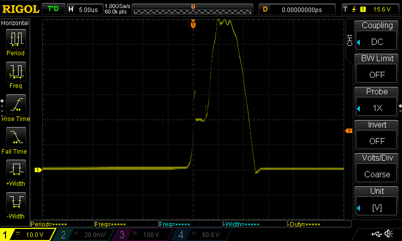

# ElectronicFlySwatter-Upgrade
Upgrade a common electrical flyswatter bat to get more punch

# Introduction

The common electronic flyswatter bat might not give enough punch to your needs, eg you might be able to get it effective on wasps and bigger flying insects (like horse flies).

# Issues with non modified Electronic Flyswatters

    * Wasps are not impressed at all with your un-modified fly swatter, and keep coming (back)
    * Huge stinging flies (like horse flies) are not impressed and keep coming also.

# Solution

    * Buy the right type! The one-layer grid is the best for catching the biggest, smallest and cleaning, but the also most dangerous for you and children.
    * Upgrade the fly swatter to get more punch, and make sure bigger insects got the message, and get either killed or at least do not longer return when hit just once. (this is what we start to talk about)

# Goals 

* higher output voltage
* higher capacity on discharge
* fast charge to ready output
* high output current for continues "frying"
* remove the high pitched sound, not warning the suspects
* Design targets:
    * Not making it too much heavier
    * Try to make use of existing design knobs and battery holder.
    * No visible difference on outside (like huge external connected capacitors or batteries)

# Commonly proposed modifications

* Remove the parallel discharge resistor, but I cannont recommend it due to hugh risk of shock
* add bigger capacitor, it works but see below. 
   

# Not seen mentioned before

* Use Alkaline batteries, and not Zink-Chloride
    * Alkaline has much lower internal resistance
     
* Replace thin power (battery) wires by thick onces
    * remove unneeded extra resistance
    
* shorten the power wires
    * remove extra resistance
* replace switching transistor with lower Vsat like ZTX1048A
    * leave a higher effective voltage on switching transformer
    Replacing the transistor did no produce that much higher output voltage, but at around 1400V way above the 1N1007 specs, which might limit the voltage because it triggers (controlled) breakdown. (See next items) 
* Upgrading the output/high voltage diode.
    * Desired properties
        * use a higher breakdown voltage
        * low capacitance
        * low reverse leakage diode
        * (ultra) fast switching
    * 1N4007 replaced by RFC4K:  Wow... by just replacing the diode (1N4007 by a RFC4K, which might not the best) voltage increased from about 1400 to 1900V !! this is the kind of changes looking for. Just below the rated value of the upgraded output capacitor) (with 22MOhm discharge resistor connected)
    * replacing the 1N4007 by a 2CL73A diode produces even 2100V !! . (With 22Mohm discharge resistor connected)
* Tuning base resistor
    * lowering the base resistor decreses charge frequency, but produces higher voltage
    * increasing the base resistor increasing the charge frequency, but lowers output voltage.
    * Be aware not to to destroy the transistor with too high base current (potentiometer set to zero)
* Increase the power supply, by replacing batteries by something else. (Dependencies: Base resistor tuning, transistor upgrade, diode upgrade, capacitor upgrade)
    * [Failed] use a boost convertor to get a higher voltage (5V). This proved far below expectations for me.
    * [Failed] Use a 9V battery Block. This proved to be far below expectations, most likely:
        * 9V battery block was empty
        * High internal resistance, not capable of producing enough current.
    * Using a 3.7 Li-ion micro battery (from RC-quadcopter). This proved to be more effective then expected, and voltage upped to over 2800V (from 2100V) 
        * Calculated with 3.7V but actual voltage was 4.1xx V. caclulating with 4.1V (vs 3V) the output voltsage increased as expected)
        * Internal resistance is expected to be low, and can keep up with the higher demand.
        * Note: later with slightly different conditions I was not able to reproduce the 2800V, after replacing the burned transistor.
    * [Failed/Work in progress] Increasing the Voltage more dramatically, by using 2 14500 Li-Ion 3.7V batteries instead 2x 1.5V AA
        * With just a singele charged Li-ion 141500 3.7V (4.2 when charged) I measured a peak of over 60V which is 10V above absolute maximum specifications, and when doubbling input voltage, this would tend to double as well, a rootcause for failure.
           

        * With just a singele charged Li-ion 141500 3.7V (4.2 when charged) I measured about 9V negative voltage, way above specs of 5V as absolute maximum: 
           
           A rootcause for immediate failure
        * By placing a 1N4007 in reverse over base emitter, this risk is easy mittigated, perhaps choosing an UF4007 later.
        

        * So it is clear now for futher "improvements" the transistor needs to be upgraded 2x60V + save margin: 150V minimum. Didn't check the current yet.
        * 
  
* [Failed] adding a Villard cascade voltage multiplier (extra diode and capacitor)
    * For some unknown reason I did not manage to get a higher voltage. then without.
    * Possible battery not providing enough current, or used wrong components.
* [Failed] replaced the electonics with the HV-1 high voltage generator and added the high voltage diode and capacitor.
    * It sparked, but I wasn't impressed by it (while using a single 3.7 Li-ion battery).
    * My multimeter dit go haywire, even when just connecting one terminal, not able to measure output voltage (possible due to much higher frequency).

# Simple tests

Issue: Most Voltage meaters won't go over 1000V DC, you possible ruin your meter when trying.

Primitive but easy to execute tests:
    * modificate the dischange reesitor my making a voltage divider and provide a low voltage meter option.
     add a resistor ~1/100 or ~1/1000 in series with the discharge resistor, and your voltmeter can easy measure/calculate the output voltage. 
    * test single discharge with a isolated screwdriver to notice possible improved "punch"
    * test repeated discharge with a isolated scredriver, and leave a smal air gab, and notice imporivemd in speed is discharges again.

# Words of warning

    * These devices are not for children
    * Removing the discharge reistor may surprise you or someone else sooner or later, I recomment to upgrade dischange resistor to voltage divider as described above.
    * Verify the original output capacitor, mine was carried labels 300V~  and 250V~ and was certainly not rated for the 2000V after upgrading. It did kept up, but I removed it.
    * Testing with transistors base resistors: too low value
        * voltage starts dropping
        * oscillating will stop
        * you might burn the switching transistor (bad batteries (Zinc-Choride) with high internal resistance might protect you)
    * Proposed modification may void warrenty
    * Proposed changes might get them no longer certified
    * Mark your fly swatter, for example with red tape, so you are remembered what has been executed on the device.
